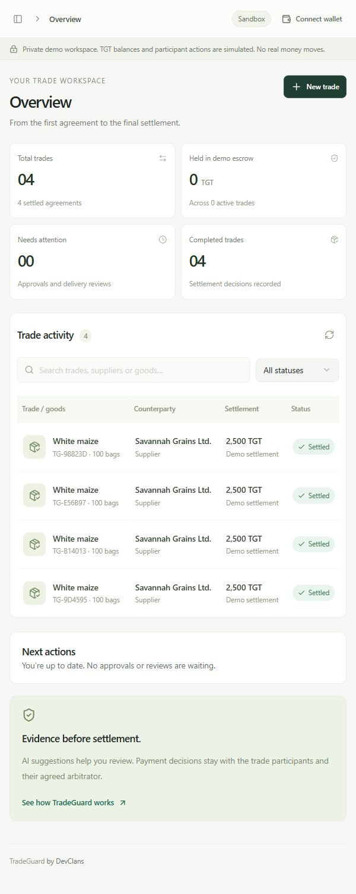
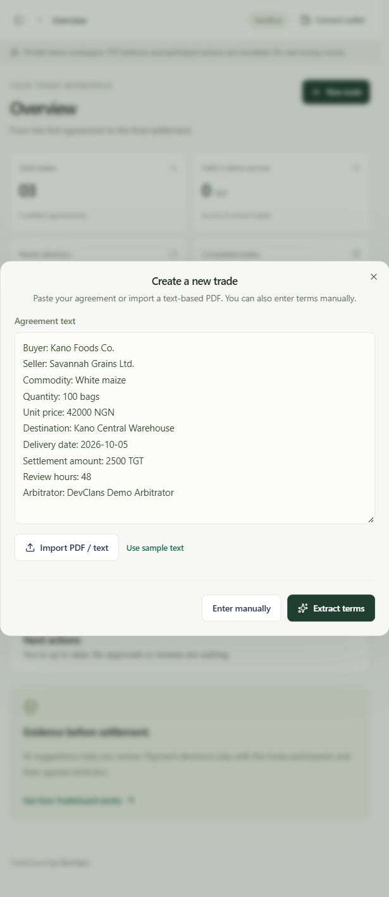
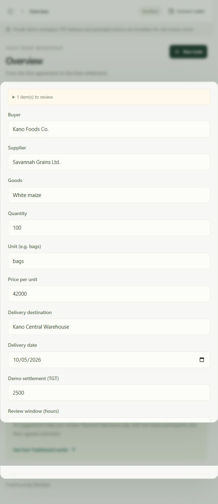
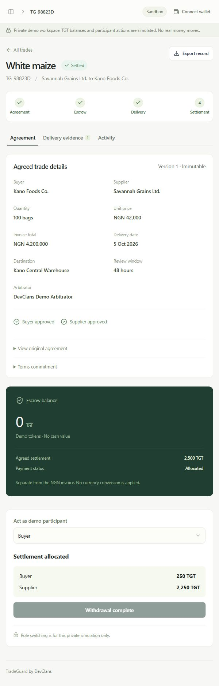
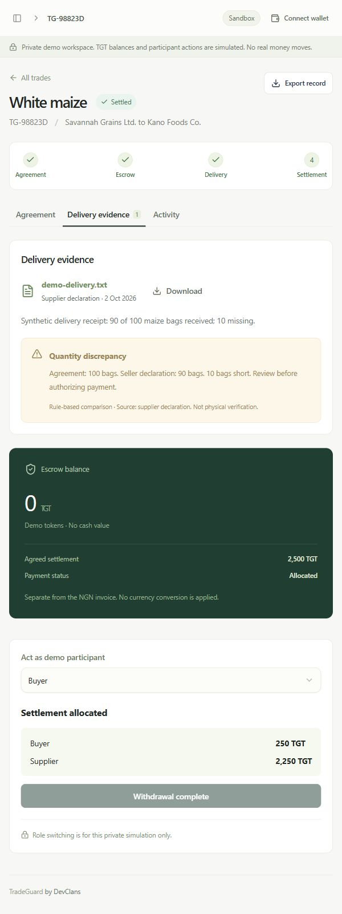
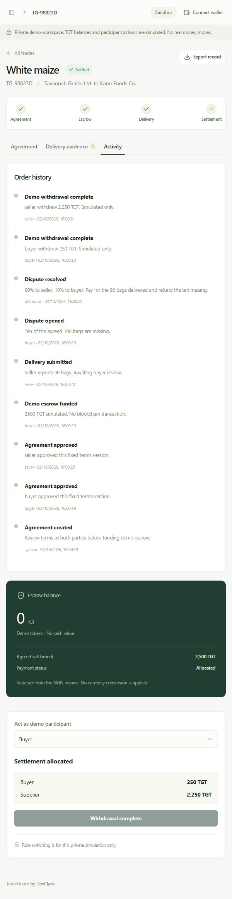
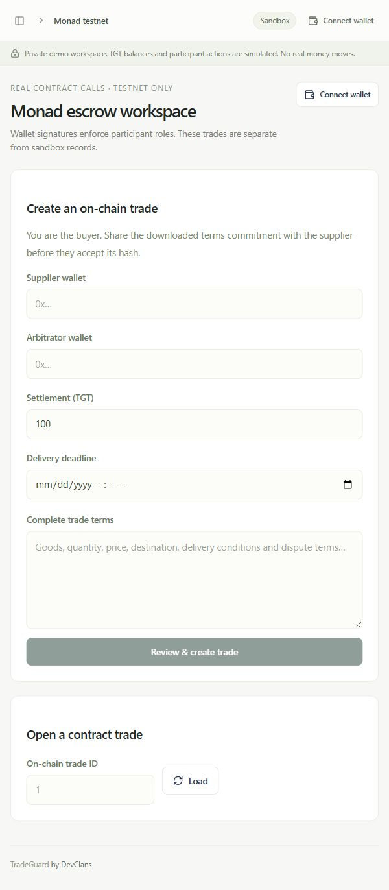

# DevClans TradeGuard

Trade agreements, reviewed AI extraction, delivery evidence and accountable escrow settlement. Singapore Qwen suggests terms; buyers, suppliers and their named arbitrator control payments. A separate workspace sends real transactions to deployed contracts on Monad testnet.

- Repository: https://github.com/Alhibb/TradeGuard
- Hosted prototype: https://devclans-tradeguard.alhibb.chatgpt.site/ (currently owner-only; arrange judge access)
- Metropolis: https://monad.xyz/developers/hackathons/metropolis
- Submission platform: https://hackathon.monad.xyz/

## Current status — 2026-10-02

TGT and escrow are deployed. Read-only checks passed for chain ID, contract code, token linkage, symbol and decimals. The latest next trade ID is **1**, so no trade has been created on this escrow yet. Local EVM tests cover settlement; the three-wallet Monad rehearsal is still required.

Local Singapore Qwen is enabled and sample browser extraction worked. Hosted Qwen and contract configuration are separate from local `.env` and still need setup. The Site remains private. No demo video or hackathon submission has been completed.

| Component | Capability |
| --- | --- |
| Agreements | Text/PDF import, extraction, manual review, approvals, fixed terms |
| Sandbox | Simulated funding, delivery, shortage checks, disputes, splits and withdrawals |
| D1 / R2 | Owner-scoped persisted trade records and evidence files |
| Singapore Qwen | Server-side suggestions requiring human review |
| Monad escrow | Separate testnet trades with wallet-enforced participant roles |

The sandbox role selector is a simulation. It does not switch wallet accounts or make sandbox records into blockchain trades.

## Screenshots

Actual local browser captures with synthetic data. These are not proof of completed Monad transactions.















## Run locally on Windows

Requires Node 22.13+ and pnpm (lockfile uses pnpm 11.25.0).

```powershell
Set-Location -LiteralPath 'C:\Users\hp\Documents\ChatGPT\TradeGuard'
pnpm install --frozen-lockfile
if (-not (Test-Path -LiteralPath '.env')) {
    Copy-Item -LiteralPath '.env.example' -Destination '.env'
}
pnpm build
pnpm local
```

Open http://127.0.0.1:5173/ and choose **Sign in to your workspace**. Use a regular browser with a wallet extension for the Monad segment. The in-app browser supports the sandbox but may have no wallet provider.

The launcher initializes D1 idempotently and retains D1/R2 state in `.wrangler/state`. The localhost sign-in fixture runs on port 5173, with a worker on 8787. This is development-only authentication; do not expose either port publicly.

Stop with **Ctrl+C**. Restart after `.env` changes. On Windows, stop the app before building: the worker can lock `dist`. Rebuild after application source changes.

## Singapore Qwen and app configuration

Edit your ignored `.env` locally:

```dotenv
QWEN_ENABLED=true
QWEN_API_KEY=YOUR_SINGAPORE_API_KEY
QWEN_BASE_URL=https://dashscope-intl.aliyuncs.com/compatible-mode/v1
QWEN_MODEL=qwen-plus
TOKEN_ADDRESS=0xfcc80262fccc19b3a833e2453e52316a0edf5f3b
ESCROW_ADDRESS=0x27ba251f396277a9af8ca7cf2cde4a279582f83a
MONAD_RPC_URL=https://testnet-rpc.monad.xyz
MONAD_CHAIN_ID=10143
```

Use a Singapore Model Studio key with model permission. Never commit `.env` or put a wallet private key in it. `.env.example` is shareable. With Qwen disabled, the labeled deterministic parser remains available.

Enabling Qwen sends agreement text to Alibaba Cloud and may incur API charges. Review every suggestion against the source. Valid schema and verified quotes do not prove accuracy. AI never receives signing keys or arbitrates.

```powershell
node --import tsx scripts/verify-qwen-live.ts
```

This check intentionally calls Qwen even if its normal enable flag is false. It reports synthetic field matches without printing the key. One fixture is not an accuracy benchmark.

Local `.env` is not transferred to Sites. Set hosted API keys through supported runtime secret entry, set the public contract addresses as hosted runtime values, and deploy to apply configuration.

## Monad deployment

| Setting | Value |
| --- | --- |
| Network / chain | Monad Testnet / 10143 |
| Gas currency | Testnet MON |
| TGT | `0xfcc80262fccc19b3a833e2453e52316a0edf5f3b` |
| Escrow | `0x27ba251f396277a9af8ca7cf2cde4a279582f83a` |
| Escrow owner | `0x70D98e179e3Ce71FdE8Ed784fA79C542D5bDEB11` |
| TGT decimals | 6 |

Explorer: [TGT](https://testnet.monadscan.com/address/0xfcc80262fccc19b3a833e2453e52316a0edf5f3b), [escrow](https://testnet.monadscan.com/address/0x27ba251f396277a9af8ca7cf2cde4a279582f83a).

```powershell
node scripts/verify-testnet.mjs
```

This checks the deployment without signing or sending transactions. **Reuse the deployed contracts for every trade.** Restarts and UI changes do not require deployment. Solidity changes to this non-upgradeable contract, or a network reset, may require new addresses.

### Fund a test wallet

Create a dedicated test account in an Ethereum-compatible wallet. Add Monad Testnet from the [official faucet](https://faucet.monad.xyz/) or use chain 10143 and RPC `https://testnet-rpc.monad.xyz`. Request testnet MON by public address and follow the faucet's current requirements.

```powershell
node scripts/check-testnet.mjs 0xYOUR_PUBLIC_ADDRESS
```

A nonzero balance does not guarantee sufficient deployment gas. Share public addresses only. Keep private keys and recovery phrases local.

### Deploy a new instance only when necessary

Skip this for the deployed instance above. Compile first:

```powershell
node scripts/compile-contracts.mjs
```

Run this block in your own PowerShell window. The helper uses local private-key signing, not browser-wallet confirmation. Enter the dedicated account's private key, never a recovery phrase.

```powershell
$tradeGuardKey = Read-Host 'Enter your TEST wallet private key locally' -AsSecureString
$tradeGuardKeyPtr = [IntPtr]::Zero
try {
    $tradeGuardKeyPtr = [Runtime.InteropServices.Marshal]::SecureStringToBSTR($tradeGuardKey)
    $env:DEPLOYER_PRIVATE_KEY = (
        [Runtime.InteropServices.Marshal]::PtrToStringBSTR($tradeGuardKeyPtr)
    ).Trim()
    if ($env:DEPLOYER_PRIVATE_KEY.StartsWith('0X')) {
        $env:DEPLOYER_PRIVATE_KEY = '0x' + $env:DEPLOYER_PRIVATE_KEY.Substring(2)
    }
    elseif (-not $env:DEPLOYER_PRIVATE_KEY.StartsWith('0x')) {
        $env:DEPLOYER_PRIVATE_KEY = '0x' + $env:DEPLOYER_PRIVATE_KEY
    }
    if ($env:DEPLOYER_PRIVATE_KEY -cnotmatch '^0x[0-9a-fA-F]{64}$') {
        throw 'Invalid key format: expected 64 hexadecimal characters.'
    }
    $env:CONFIRM_TESTNET = 'yes'
    $env:MONAD_CHAIN_ID = '10143'
    $env:MONAD_RPC_URL = 'https://testnet-rpc.monad.xyz'
    node scripts/deploy-testnet.mjs
    if ($LASTEXITCODE -ne 0) {
        throw 'Deployment failed. Check transaction history before retrying.'
    }
}
finally {
    Remove-Item Env:DEPLOYER_PRIVATE_KEY -ErrorAction SilentlyContinue
    Remove-Item Env:CONFIRM_TESTNET -ErrorAction SilentlyContinue
    Remove-Item Env:MONAD_CHAIN_ID -ErrorAction SilentlyContinue
    Remove-Item Env:MONAD_RPC_URL -ErrorAction SilentlyContinue
    if ($tradeGuardKeyPtr -ne [IntPtr]::Zero) {
        [Runtime.InteropServices.Marshal]::ZeroFreeBSTR($tradeGuardKeyPtr)
    }
    if ($null -ne $tradeGuardKey) { $tradeGuardKey.Dispose() }
}
```

Save the printed `TOKEN_ADDRESS` and **`ESCROW_ADDRESS`** (including the initial E). Update `.env`, restart, and verify. Hosted values must be configured separately. The deployer becomes owner; each trade names its own arbitrator.

The helper deploys both contracts on every invocation. If the second fails, inspect transaction history and recover the first contract address before retrying. Do not repeatedly redeploy blindly.

## Complete sandbox demo

1. **New trade → Use sample text → Extract terms**. Check the actual provider label and compare every field with the source. The sample-trade shortcut skips Qwen.
2. Save the 100-bag maize order: NGN 42,000 per bag, NGN 4,200,000 invoice, separate 2,500 TGT demonstration settlement.
3. Approve as buyer and supplier. Switch to buyer and fund demo escrow.
4. As supplier, record **90 bags**, describe the shortage, and attach a synthetic delivery receipt.
5. As buyer, inspect **Delivery evidence**, download the receipt, then raise a dispute.
6. As arbitrator, allocate **90%** to supplier with written reasoning: supplier 2,250 TGT, buyer 250 TGT.
7. Withdraw as buyer and supplier. Check zero remaining demo escrow, export the record, refresh and verify persistence.

## Complete three-wallet Monad demo

Prepare distinct buyer, supplier and arbitrator accounts. Each needs testnet MON for signing. Choose **Monad testnet** in the sidebar. Every time you switch wallet accounts, reconnect in the app and **Load** the same trade ID.

### Get buyer TGT

The UI currently has no faucet button. Select Buyer and Monad Testnet in your wallet, connect on the local app, open the browser developer Console and run:

```javascript
const tgChain = await window.ethereum.request({method: 'eth_chainId'});
if (Number(tgChain) !== 10143) throw new Error('Switch to Monad Testnet.');
const [tgBuyer] = await window.ethereum.request({method: 'eth_requestAccounts'});
await window.ethereum.request({
  method: 'eth_sendTransaction',
  params: [{
    from: tgBuyer,
    to: '0xfcc80262fccc19b3a833e2453e52316a0edf5f3b',
    data: '0xde5f72fd',
    value: '0x0'
  }]
});
```

Review and confirm in your wallet. This calls `faucet()` and mints 10,000 no-value TGT. For another deployment, replace the token address. Import TGT in the wallet using its address, symbol TGT and six decimals.

### Create, settle and withdraw

| Step | Wallet | Action |
| --- | --- | --- |
| 1 | Buyer | Enter supplier and arbitrator addresses, 2,500 TGT, future delivery deadline and complete terms. **Review & create trade**, retain downloaded terms JSON, **Continue in wallet**, confirm. Save the resulting trade ID. |
| 2 | Supplier | Review the terms JSON and hash, reconnect/load, **Accept terms hash**. Status: Accepted. |
| 3 | Buyer | **Approve exact TGT allowance**, wait, then **Fund escrow**. Status: Funded. |
| 4 | Supplier | Enter 90/100-bag delivery text, **Submit evidence commitment**, retain downloaded preimage. Status: Delivered. |
| 5 | Buyer | Enter shortage reason, **Dispute delivery**. Status: Disputed. |
| 6 | Arbitrator | Enter reasoning, set **Supplier allocation (TGT)** to **2250**, **Resolve dispute**. Status: Settled. |
| 7 | Supplier | Reconnect/load, **Withdraw to connected wallet**: 2,250 TGT. |
| 8 | Buyer | Reconnect/load and withdraw 250 TGT. Both credits become zero. |

Each action opens an app confirmation and wallet signature request. Wait for successful receipts and keep transaction hashes/explorer links for the submission. The UI checks chain, token and decimals and simulates calls before signing.

Share the downloaded salted terms commitment with the supplier before acceptance. Evidence text/preimages remain off-chain; their commitments are on-chain. Testnet documents are not automatically attached to sandbox R2 records.

## Tests

```powershell
pnpm exec tsc --noEmit
node --import tsx --test tests/domain.test.ts tests/extraction.test.ts
node scripts/compile-contracts.mjs
node --test tests/contracts.test.mjs

# With pnpm local running:
node --import tsx scripts/verify-local-demo.ts
node --import tsx scripts/verify-local-worker.ts

# Read-only chain checks:
node scripts/verify-testnet.mjs
```

Domain/extraction: **11 passing tests**. Local EVM: **7 passing tests**. Ganache uses its JavaScript fallback on Node 24; that optional native warning does not invalidate the tests.

API scripts create synthetic local records. They verify extraction, approvals, funding, evidence upload/download, disputes, exact 90/10 allocations, both withdrawals, persistence, stale-version rejection and access boundaries. The worker script uses localhost-only identity fixtures to check cross-owner denial. These are not production ingress or live-wallet tests. See [verification record](docs/VERIFICATION.md).

## Metropolis submission guide

The [official event page](https://monad.xyz/developers/hackathons/metropolis), read 2026-10-02, requests a working product with a public project profile: **demo, short write-up and code link**. It lists a **13 October** deadline, judging **14–27 October**, and winners **3 November**. Confirm the precise year, cutoff time/timezone, video duration, eligibility and sponsor rules on the application platform.

Existing projects are allowed if the submitted work is new within the six-week build window. Open source is encouraged; judges must be able to verify the work. Suggested track: **Consumer Products & Payments**, because TradeGuard centers on payment and settlement. Choose it in the actual form.

1. Open https://hackathon.monad.xyz/ and create your team/project profile. Review the current official rules.
2. Add the pitch below and identify work completed during the eligible window through commits.
3. Supply the GitHub URL, contract explorer links, a judge-accessible app URL, demo and transaction proof. The hosted app currently needs a judge-access choice; do not rely on its owner-only link.
4. Configure hosted Qwen and contract values securely, deploy and verify the hosted flow. Local screenshots do not prove hosted setup.
5. Record the sandbox extraction/evidence flow and the separate three-wallet Monad flow. Label both accurately and keep credentials out of the video.
6. Check links and required fields, submit before the exact platform cutoff, and save the confirmation/profile URL.

**Copy-ready pitch:** TradeGuard turns trade agreements into reviewed terms, delivery evidence and accountable escrow settlement. Singapore Qwen suggests structured terms for human approval. Buyers and suppliers commit to the same agreement, and a named arbitrator resolves delivery disputes. Monad testnet contracts enforce wallet roles, hold no-value TGT and let each participant withdraw their allocation independently.

**Demo story:** A buyer orders 100 maize bags with a 2,500 TGT demonstration settlement. Only 90 arrive. Evidence highlights the shortage, the buyer disputes, the arbitrator allocates 2,250 TGT to the supplier and 250 TGT to the buyer, and both withdraw.

See [submission guide](docs/METROPOLIS_SUBMISSION.md), [narration](docs/DEMO_NARRATION.md), and [remaining work](docs/SUBMISSION_STATUS.md). Screenshots support the write-up; they do not replace a working product, wallet proof or requested video.

## Prototype limitations

- Not audited; use only no-value TGT on testnet. Only the supplied standard six-decimal token is supported.
- Deadlines are advisory after funding. Unavailable arbitration and refusal of mutual settlement can lock funds indefinitely; there is no unilateral timeout payout.
- Opening a dispute clears prior mutual consent. The owner cannot sweep escrow; renunciation is disabled.
- Quantity checks and evidence declarations do not verify physical delivery. Scanned PDFs need external OCR.
- Sandbox roles are not multi-user authorization. Hosted authentication relies on trusted Sites ingress; never expose the raw worker publicly.
- AI output requires review and never controls payments.

See [contract review](docs/CONTRACT_REVIEW.md).
